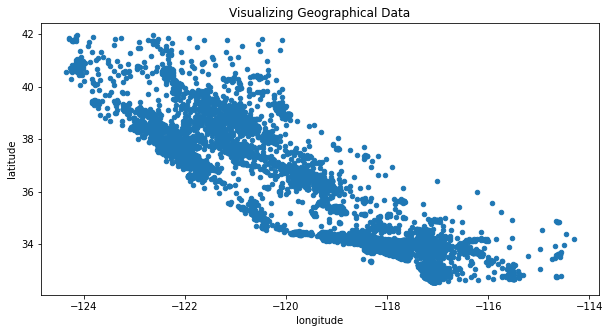
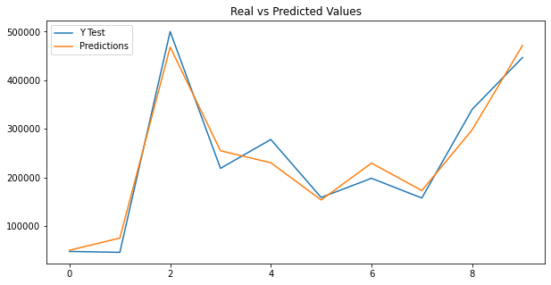
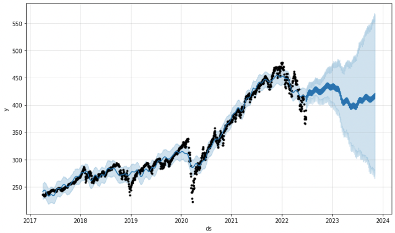
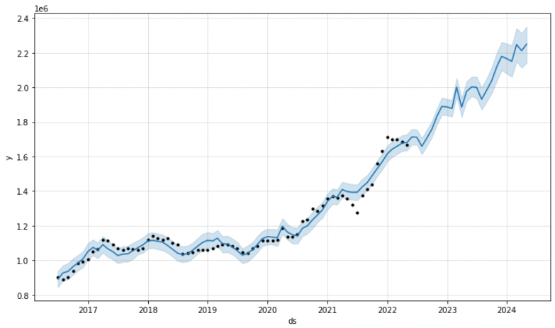

# Redefine Gentrification Project

### In part one of this project, our team analyzed sets of data consisting of housing sales in the top 5 most gentrified cities across the United States. Using the data we were able to identify how gentrification can affect a city's housing market, as well as the population by each ethnicity.

### In part two of this project, we analyzed a few sets of data:

* The median house prices for the state of California in which we were able to identify the predicted error values.
* The average listing price in the NY-NJ market and compare it to the S&P 500.

### Our mission is to provide each community with the financial cost of redeveloping from within and preventing gentrification by big businesses.

- - -

### Files

[California Housing Prices](Part-2/house_price_prediction.ipynb)

[NYC Prophet](Part-2/NYC_Prophet.ipynb)

[SPY Prophet](Part-2/SPY_Prophet.ipynb)

- - -

## Summary of Project-Part 1

### **[What is Gentrification?](https://www.youtube.com/embed/OFKJ45J-LMg)**

Gentrification is a process in which a poor area (as of a city) experiences an influx of middle-class or wealthy people who renovate and rebuild homes and businesses and which often results in an increase in property values and the displacement of earlier, usually poorer residents

### **Criteria Used to Evaluate Gentrification**

Five factors that are examined for an area to be susceptible to gentrification:
1. Which communities are most at risk from job displacement in the hospitality, retail, personal care, and service sectors.
2. Which communities are at risk due to a disproportionate high percentage of residents not enrolled in Unemployment Insurance benefits
3. Which communities have high numbers of renter households that are experiencing extreme financial hardships
4. Which communities are most burdened by shelter-in-place mandates
5. Which communities are likely to be unrepresented in the census due to low response rates

### **Types of Gentrification**

In 2018, Los Angeles exhibited the highest rates of gentrification, with 10% of areas classified as At Risk of Gentrification, Early/Ongoing Gentrification, or Advanced Gentrification. In addition, 5% of areas were not gentrifying but experienced Ongoing Displacement of Low-Income Households. Nearly half of all Atlanta neighborhoods experienced a rapid increase in housing costs between 2000 and 2017. 22% of lower-income neighborhoods in Atlanta were at risk of gentrification in 2017, and 7% were undergoing displacement of low-income households without gentrification. Almost 8% of low-income households in the metro region are living in moderate to high income neighborhoods that are experiencing advanced stages or super gentrification.

### **Real Estate Data Elements**

With this data, communities will possess the same data that real estate investment companies use to gentrify cities. This gives a financial estimate as to what it would cost to redevelop a community.

### **A World Without Gentrification!**

### **So how would we do this?**
We would create a DAO (decentralized Autonomous Organization) with a token sale based on the valuation data gained. The community will use this data to pick opportunity zones. The voting system that will be set up to these communities to hold a larger voting power than those just financially invested. We hope to build a future where the voting system can cover items such as which opportunity zones to invest in. Whether that being swim clubs over parks or basketball courts over tennis courts. Create a community that will truly reflect the people that live there. 

- - -

## Summary of Project-Part 2

### **California Housing Prices**

This scatter plot shows where most of the houses in the dataset of median house prices for the state of California are positioned.

We found that Random Forest had the lowest root mean squared error (RMSE) and continued using that to compare the median house prices. As you can see they weren’t that far apart from each other.

### **SPY and NYC Housing Market Trend**

The general consensus of the stock and housing markets are that the prices are affected by the Federal Funds Rate. While they do not directly dictate price action or mortgage rates, higher interest leads to lower demand and vice versa. The NYC housing market trendline seems to follow the S&P 500, but at a one year lag. 

### **S&P 500 (SPY) Prophet Forecast**

### **S&P 500 (SPY) Prophet Forecast**

- - -

### Resources

[Attom Table of Data Elements](https://www.attomdata.com/data/)

[California Housing Prices](https://www.kaggle.com/datasets/camnugent/california-housing-prices?resource=download)

[Data for NYC and SPY Prophet](https://fred.stlouisfed.org/series/FEDFUNDS)

- - -